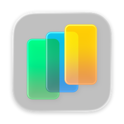
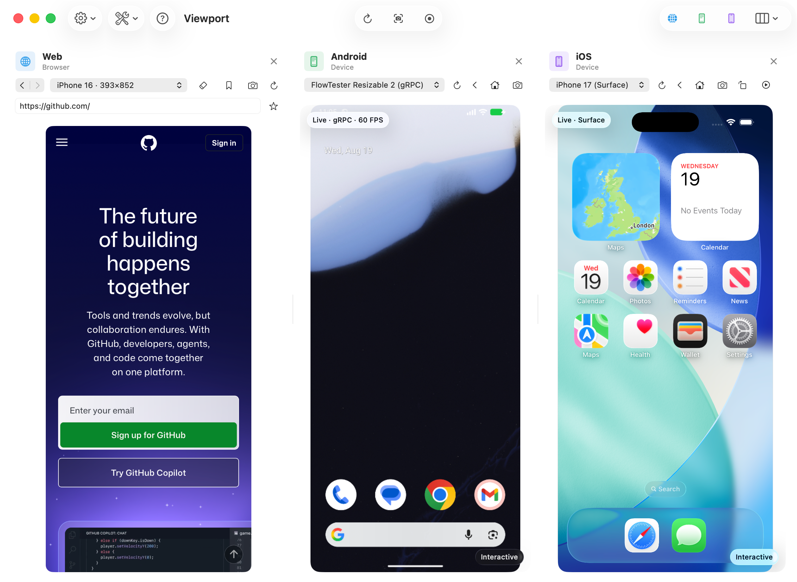

<p align="center">
  
</p>

# Viewport

Web, Android and iOS in one window on your Mac.

Open a website alongside an Android emulator and an iOS Simulator to see how they compare. It's a handy setup for demo videos and feature walkthroughs: show your app across platforms in a single recording, without switching between windows. Connected phones and tablets work too.



## What you can do

- Record demo videos and walkthroughs with all visible panes together in one MP4.
- Capture and annotate screenshots for release notes, documentation or bug reports.
- Show or hide web, Android and iOS panes to suit what you're working on.
- Tap, type, paste, open deep links and set device locations. You can also mirror input across supported panes.
- Build and install Xcode or Android projects on simulators and emulators with **Build & Play**.
- Read web console messages, Android logcat and simulator logs alongside the devices.
- Use **Light Sim**, powered by [simslim](https://github.com/MobAI-App/simslim), as an alternative to the standard iOS Simulator. Install it from Help or the iOS Play menu.

Connected iPhones and iPads are view-only. Touch, keyboard input, deep links and device logs aren't available for them.

## Getting started

Viewport requires **macOS 26 or later**. You'll also need:

- **Xcode** for iOS simulators and building Viewport from source.
- **The Android SDK** for Android emulators.
- **scrcpy** for connected Android phones: `brew install scrcpy`.

Light Sim is optional. You can also install it with `brew install mobai-app/tap/simslim`.

## Build from source

```sh
xcrun swift build --disable-sandbox
```

## License

Copyright 2026 Longden. Licensed under [Apache 2.0](LICENSE), with [third-party notices](THIRD_PARTY_NOTICES.md).
